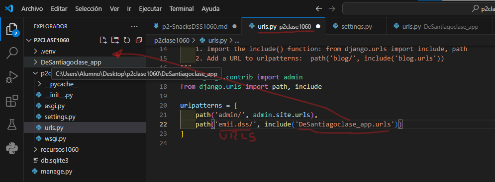

- Crear aplicacion DeSantiago_app
- Comando --> python manage.py startapp DeSantiago_app
- Creamos el archivo urls..py en DeSantiago_app
- 
- En sentting.py de p2clase1060
- 
- En urls.py de p2clase1060
- 
- en urls.py en DeSantiagoclase_app
- 
- En views.py en DeSantiagoclase_app
- 
- En urls.py en DeSantiagoclase_app
- 